# 10. 信息与不对称信息

## 10.1. 信息总论

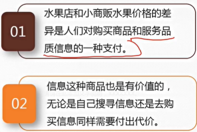

**最优信息**

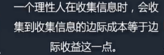

**统计歧视**

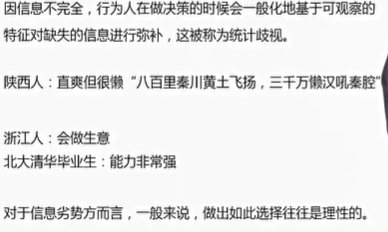

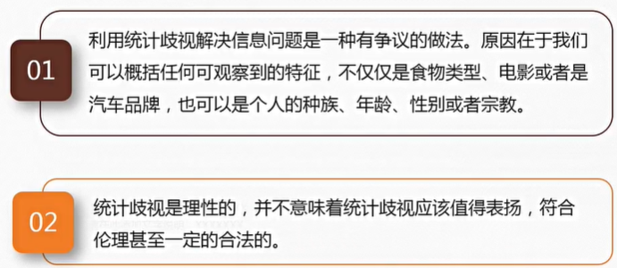

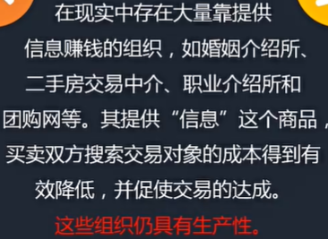

**信息与其他商品的差异**

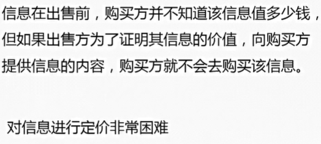

## 10.2. 不完全信息

**不对称信息和市场失灵**

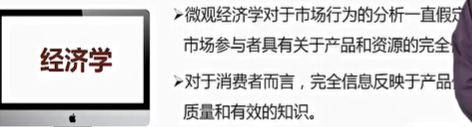

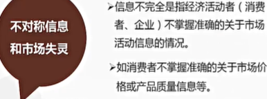

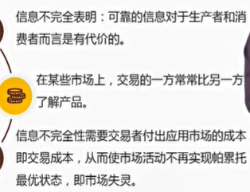

**不对称信息的分类**

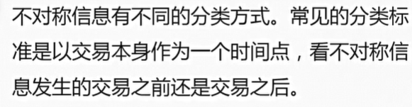

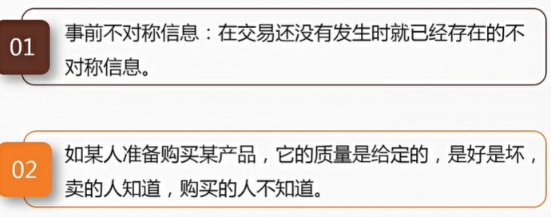

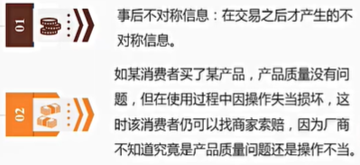

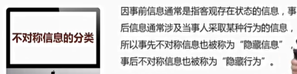

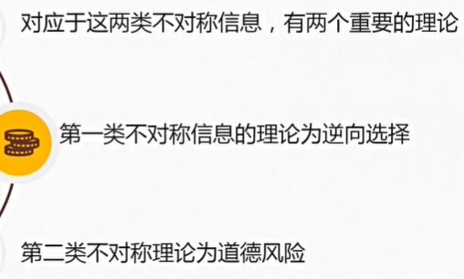

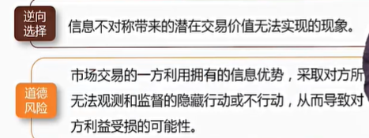

**次品市场和逆向选择**

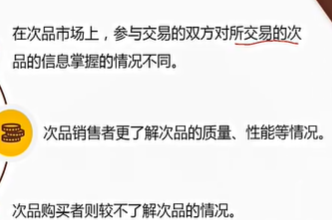

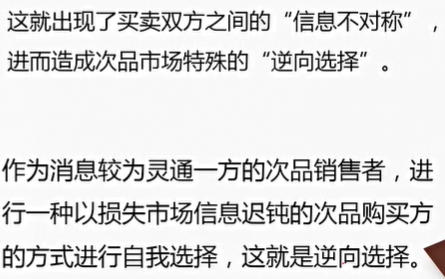

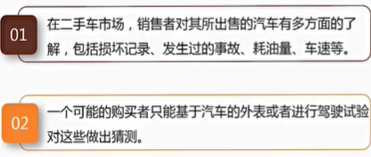

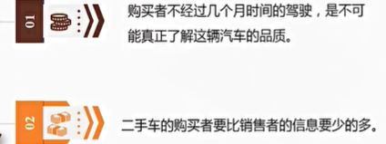

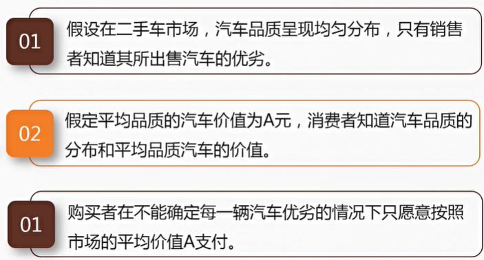

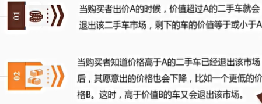

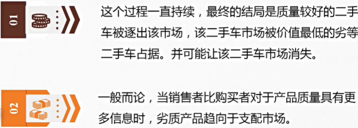

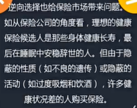

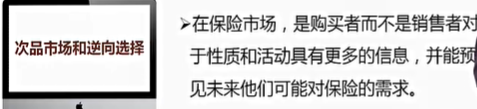

**保险市场和道德风险**

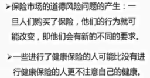

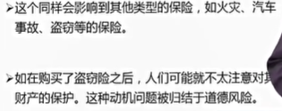

**非对称信息下市场失灵了吗？**

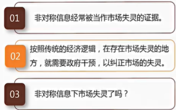

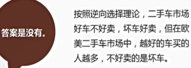

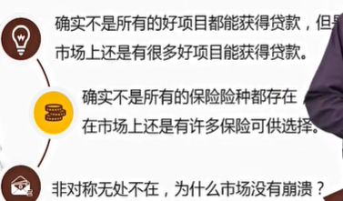

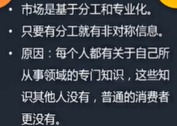

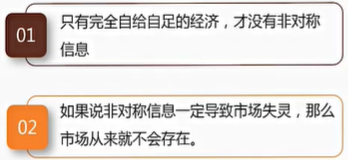

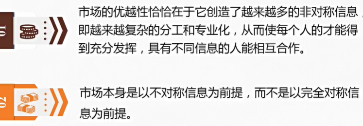

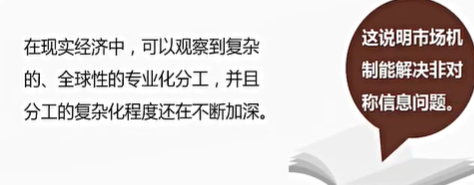

**解决方式**

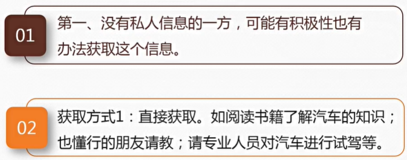

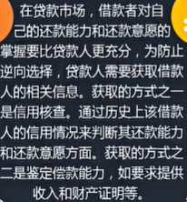

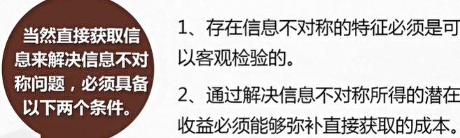

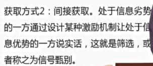

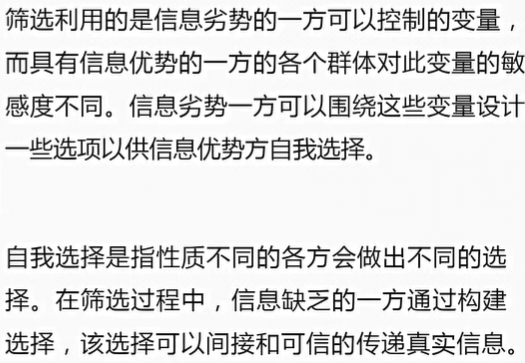

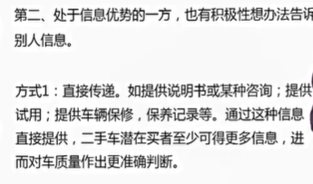

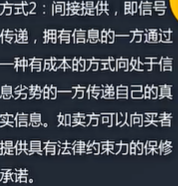

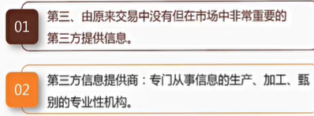

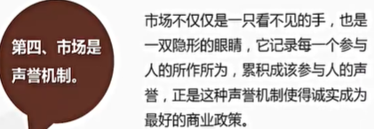

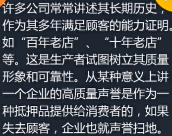

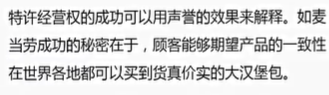

## 10.3. 委托代理理论

**道德风险是委托代理问题的根源**

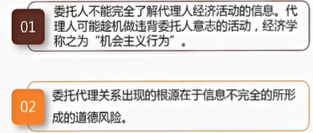

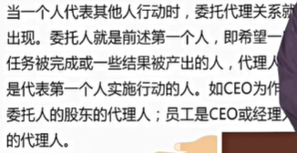

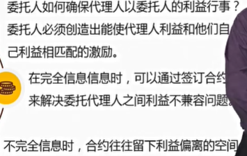

**监督和激励机制设计**

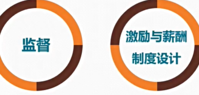

**监督：打卡记录**

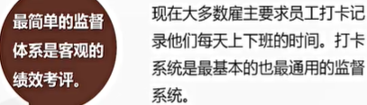

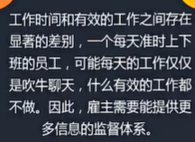

**监督：现场检查**

**监督：风险抵押金**

**监督：顾客监督员工**

