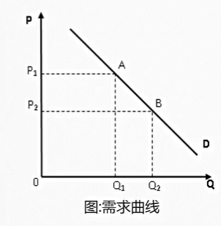
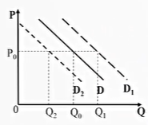
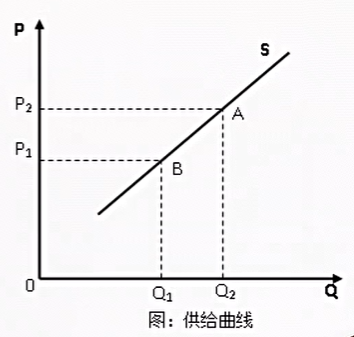
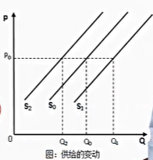
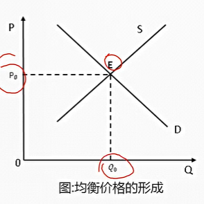
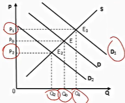
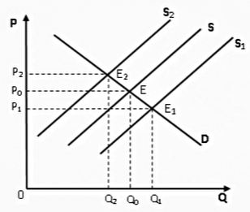
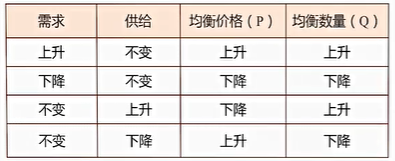
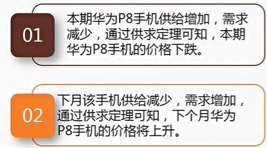
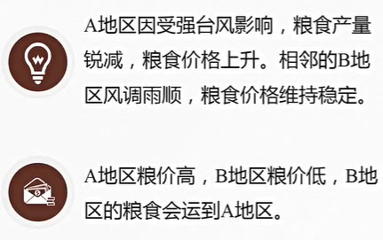

# 3. 需求、供给与均衡

## 3.1. 需求

需求定理是全部经济学中最有说服力的定理，它在解释纷繁复杂的人类行为方面有惊人的解释力。

需求量是指消费者愿意并能够购买一种商品或服务的数量

> 愿意：表示主观上有这个需要
>
> 能够：表示具有购买能力
>
> 需求是购买欲望和购买能力的同一

**需求定理**

对一种物品的需求是由多少因素决定的。价格、偏好、其他商品的价格。价格在其中起着最重要的作用。

需求定理描述的是价格和需求的关系。在其他条件不变的情况下，价升量跌。

**需求曲线的移动**

原因：其他条件的变化

购买的数量在每一价格水平上增加时，需求曲线向右移动-》需求增加

购买的数量在每一价格水平上减少时，需求曲线向左移动-》需求减少

**影响需求的主要因素**

1. 收入。收入上升，不一定对所有商品的需求增加。
2. 相关商品的价格。替代品的价格会影响（负相关）。互补品的价格影响（正相关）
3. 偏好。偏好是由历史和心理所决定的。生物经济学研究偏好的形成。自然选择的结果，是使每一种生物在与其他生物竞争时，争取繁衍成功的最大化。偏好的改变会影响需求
4. 预期

**市场需求**

1. 所有人对某种特定物品和劳务需求的总和
2. 可以通过把个人需求曲线水平相加得到市场需求曲线

## 3.2. 供给

供给和需求是对应的概念。

**供给量**是厂商愿意并且能够出售的某种商品或服务的数量

**攻击定理**是其他条件不变时，价升量升

**供给曲线的移动**

原因：其他条件变化

在每一价格水平上供给都增加会使供给曲线向右移动-》供给增加

在每一价格水平上供给都减少时，供给曲线向做移动-》供给减少

**影响供给的主要因素**

1. 投入品价格。一种物品的供给量与生产这种物品所用的投入品的价格负相关
2. 技术。
3. 预期

**市场供给**

1. 市场供给量是在每种价格上所有卖者的供给量的综合
2. 可以通过把个人供给曲线水平相加得到市场供给曲线

**供给量变动**

1. 价格变化对供给量变动的影响
2. 表现为供给曲线的移动

## 3.3. 均衡与供求定理

**需求与供给的转换**

1. 价格越高，需求越少，供给越多
2. 只要价格足够高，人们就不仅会停止购买，而且会开始供应，即随着价格的提高，需求者会变成供给者

**均衡价格和均衡数量**

均衡价格是使得供给量等于需求量的价格

均衡数量是当价格调整到供给与需求相等时的供给量与需求量

在均衡价格下，买者愿意且能够购买的数量刚好与卖者愿意而且能够出售的数量相一致

**市场为什么会出于均衡状态**

1. 在没有人为力量干预的情况下，市场力量能够自发的达到供给等于需求的均衡状态
2. 当市场价格高于均衡价格时，市场价格会下降，当市场价格低于均衡价格时，市场价格会上升

**价格时在市场竞争中自发形成的**

1. 当某商品的供给大于需求时，生产者为了讲东西卖出去会竞相降价
2. 当某种商品的供给小于需求时，消费者为得到的东西会竞相提价
3. 卖方倾向于和其他卖方竞争，卖方倾向于和其他买方竞争，而不是卖方和买方之间的竞争
4. 众多的买者和卖者之间的竞争使得任何一笔交易都依赖于双方形成一致的条款。高价不等于贪婪，低价不等于慷慨

**价格之外的变化，对均衡的影响是什么**

**需求变化**

**供给变动**

**供求规律**

分析均衡变动的三个步骤

1. 确定该事件是使供给曲线还是需求曲线发生移动；或是两者都移动
2. 确定该曲线的移动方向
3. 用供求图说明这种移动如何改变均衡价格和均衡数量

## 3.4. 套利

> 1. 跨时间套利
> 2. 跨地点套利

**跨时间套利**

本期华为手机价格下跌，下跌到什么程度？下期该手机价格上升，上升到什么程度？

**跨期均衡**：在不考虑需求者和供给者的时间偏好情况下，华为手机价格将调整到本月和下月相等为止

**跨地点套利**

**跨地区均衡**：粮食价格将调整到A地区粮价等于B地区粮价加上将单位粮食从B地区运到A地区成本为止

讨论：食物可以套利，但是房子无法套利

## 3.5. 价格是代价

1. 价是商品的价格？
2. 将价格理解为代价，即成本
3. 即包括货币成本，也包括非货币成本
4. 没有市价，或市场不存在，需求定理依然适用

讨论：为什么会去便利店购买商品，尽管贵于大超市（考虑非货币代价即时间代价）

讨论：为什么不点名的老师的选修课的到课人数更多（选课所需要付出的代价更少）

制约人行为的关键因素是代价，需求定理正是刻画这个关键因素与人的选择行为之间的关系。因此，对“价”的概念的扩展也是经济学帝国主义的基础（经济学解释一切）

有些行为并不是市场行为，但是一定存在代价。有行为就有代价。这些非市场行为尽管没有货币代价（价格），但一定会有非货币代价（价格）

价升量跌的需求定理同样可以用于分析非市场行为。在此时，需求定理可以描述为：当一项行为的机会成本上升时，选择者会少选择这种行为；当一项行为的机会成本下降时，选择者会多选择这种行为。

**雷尼尔效应**：环境好的学校，反而薪水更少（一部分由环境的形式补偿）。为美好景色牺牲高收入。

## 3.6. 价是相对价格（需求第三定律）

**价是什么？**

微观经济学认为的价是相对价格，即本商品相对于其他商品（或参照系）的价格，而不是价格水平

产茶的茶农为什么不喝好茶：假设茶叶分为两类，以不好的茶叶为参照系，好茶的相对价格为xx斤不好的茶叶；在外地，好茶的相对价格为yy斤不好的茶叶（yy<xx）；好的茶叶会外运。

## 3.7. 需求定理不存在反例

是否存在向上倾斜的需求曲线？

吉芬商品（劣等品的一类）：右上方倾斜需求曲线的商品。如爱尔兰土豆，价格上涨，需求增加。这样的商品不可能在市场上成交（张五常）

奢侈品（不是吉芬商品）：价格上升，区别别人的代价下降；代价下降，需求上升。符合需求定理。

股票追涨不追跌：买进股票的人一定认为股价继续上涨才会买股票，即相对以后而言，现在的股票价格已经很便宜；卖出股票的人一定认为股票继续下跌才会卖股票，即相对以后而言，现在的股票价格非常贵。符合需求定理。真正使一个人决定买进还是卖出股票，不是股票现在的价格高还是低，而是预期价格高或低。追涨行为，其实不是追涨，而是不断上涨的行情容易使人们产生股价还会继续上涨的预期，所以人们选择买进；杀跌行为，其实不是杀跌，而是不断下跌的行情容易让人们产生股价还会继续下跌的预期，所以人们选择卖出。

衣服标高价反而被卖出：其他条件发生变化（信息）。消费者往往采用“以价定质”的手段节约有关信息的费用，即价格高，质量一般较好；质量高和低的衣服不是同一种商品，两者需求曲线不同；长期来看，信息扩散，淘汰“价不对质”商品，但短期，商家可以欺骗。衣服涨价后需求大增，使以下两个因素的合并作用：买的人不知情，以价定质而错误判断了这件衣服的价格；价值200元质量的衣服的需求曲线位于价值20元曲线的右上方。

## 3.8. 需求定理的应用

**赞扬价格欺诈**

假设某地地震，物价上涨。奸商趁火打劫，“价格欺诈”。要不要对奸商的不道德行为处罚？价格欺诈使得商品交给了最需要它们的人。

从价格欺诈者的角度看：承担了风险是为了获得高额回报

批评价格欺诈者的人并没有理解市场所传递的信息和激励。价格机制在灾难发生时与平时一样运作的有效。对价格欺诈者进行惩罚，会破坏市场机制本身固有的协调能力，从而造成效率的低下。
