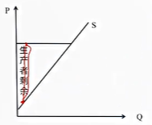

# 4. 经济效率与弹性

## 4.1. 消费者剩余与生产者剩余

**衡量市场效率的方法**

1. 消费者剩余与生产者剩余
2. 帕累托标准

**消费者剩余与生产者剩余**

1. 消费者剩余测量消费者从市场交易中获得的净收益
2. 生产者剩余测量生产者从市场交易中获得的净收益
3. 生产者剩余和消费者剩余之和衡量市场交易的总收益

**消费者剩余**

1. 对于多数消费者而言，其购买该商品愿意支付的价格超过市场价格
2. 消费者剩余指消费者消费一定数量的某种商品愿意支付的最高价格与这些商品的实际市场价格之间的差额
3. 消费者剩余衡量了买者自己主观上购买商品所获的额外收益
4. 消费者总剩余可以用需求曲线下方，价格线上方和价格轴围城的三角形的面积表示

**生产者剩余**

在市场上，生产商按照现行价格出售商品，但对于多数生产商而言，其出售商品的价格高于其愿意出售商品的最低价格

1. 生产者剩余是指生产者出售一定数量某种商品市场价格预期愿意接受的最低价格之间的差额
2. 生产者剩余衡量了生产者自己感觉到所获得的额外收益

**总福利**

生产者剩余+消费者剩余=社会因市场交易产生的总福利

1. 市场交易不仅不是零和博弈，无论是消费者还是生产者，通过交易，均增加了自己的剩余，因此贸易使得人们过的更好
2. 在绝大多数情况下，自利的消费者和生产者在价格机制的作用下，实现着总剩余（社会福利）的最大化，这就是看不见的手定理

**讨价还价策略**

为什么不直接以中间价格报价，这样不是可以节约交易时间吗？如果你是卖者，如果你确切知道买者愿意支付多少钱，那么你就不会接受任何低于那个数值的价格。因此，作为买者，你会在卖者前隐瞒自己的真实支付意愿。同理，如果你是卖者，你也会在潜在买者前隐瞒自己的真实愿受价格。

因此，无论是买者还是卖者，都会以一个远远偏离心理预期的价格开始报价，希望能实现自己的消费者剩余（或生产者剩余）的最大化

**公共政策中的成本收益分析**

1. 电力需求侧管理
2. 给你多少钱，你愿意在用电高峰时期接受通断电管理等问题，寻找消费者剩余较少的目标客户，对他们进行需求侧管理

## 4.2. 帕累托标准

**帕累托最优（效率）**

1. 是指在某种既定的资源配置状态，任何改变都不可能使至少一个人的状况编号，而又不使任何人的状况变坏
2. 着意味着要使一个人的情况变好，唯一的方法是使得另一个人的情况变坏

**帕累托改进**

对在不使其他人情况变坏的情况下，使得某人的情况变好的资源再配置

**福利经济学定理**

1. 第一定理：竞争市场所达到的均衡分配必定是帕累托最优配置
2. 第二定理：社会通过适当地安排初始资源禀赋，让人们彼此自由交易，就可以实现帕累托最优的资源配置

**注意**

存在许多的帕累托有效率分配。特定的财富分配对应着特定的帕累托效率，为达到特定分配，政府需要制作的唯一事情就是再分配初始财富。在初始财富分配后，通过竞争性市场程序，就可以实现帕累托效率资源配置。

要实现资源有效配置和合意的收入分配，不必要一个具有理论经济家和乌托邦社会主义者的所有智慧中央计划者；以利润最大化为目标的竞争性企业可以比所有可能的中央计划者要好。（市场机制的优越性）

要达到效率和公平目标，只需要对资源进行再配置，在市场机制的作用下，可以达到帕累托均衡。

赞扬价格欺诈，说明了第一定理，竞争市场所达到的均衡必定是帕累托最优配置，因此当灾难发生时，资源被配置到了评价最高的那个人身上。

**质疑：公平的目标；福利经济学定理**

假设这种观点被大家所接受，也被用于救灾实践。如在发生灾难时，先对水按人均进行分配。福利经济学第二定理告诉我们，在对水进行平均分配后，只要不仅指水的市场交易，资源同样会被配置到评价最高的那个人身上，同样可以实现帕累托最优的资源配置。

## 4.3. 需求弹性

1. 弹性时消费者或生产者对市场条件变化的反应程度（敏感性）
2. 常见的弹性：需求（价格）弹性、收入弹性、供给（价格）弹性、交叉弹性

**需求价格弹性**

1. 需求弹性，是指在一定时期内一种商品的需求量变动对于该商品价格变动的敏感程度
2. 该弹性用需求量变动的百分比除以价格变动的百分比计算

解释

1. 因为需求曲线一般向下倾斜，即价格和数量之间呈现反方向变动的关系，因此，我们在前加负号，以保证弹性为正
2. 需求价格弹性取决于价格上涨时消费意愿下降的程度，与数量或价格的单位无关，因此是无量纲的
3. 在需求量和价格这两个经济变量中，价格是自变量，需求量是因变量，所以，需求弹性就是价格变动所引起需求量变动的程度，或者说需求量变动对价格变动的反应程度

分类

1. 完全无弹性（弹性为0）：价格变动不会引起需求量的变动（刚性需求，很少）
2. 完全弹性（弹性无穷大）：价格小幅度变化就会导致需求量的无穷变化
3. 单位弹性（弹性等于1）：价格的变动引起需求量的同比例变动
4. 富有弹性（弹性大于1）：价格的小幅度变动就能引起需求量大幅度变动
5. 缺乏弹性（弹性小于1大于0）：价格大幅度变动才能引起需求量的小变动

**弹性$\neq$斜率**

1. 对线性需求曲线而言，各点都有相同的斜率，但各点的弹性不同
2. 较陡斜率并不意味着缺乏弹性
3. 较平滑斜率也不意味着富有弹性

**影响需求价格弹性的因素**

一种商品的弹性取决于商品的可替代性、商品用途的广泛性和商品对消费者生活的重要性、考察时间长短等因素

1. 商品的可替代性。一般认为，一种商品的可替代品越多，相近程度越高，则该商品的需求的价格弹性往往越大；对一种商品所下的敬意狭窄，这种商品的相近替代品往往越多，需求的价格弹性也就越大
2. 商品用途的广泛性。一种商品用途越广泛，其需求价格弹性就可能越大。如果一种商品有多种用途，当它的价格较高时，消费者只够买较少的数量用于最重要的用途上。当它的价格逐渐下降时，消费者会增加购买以将商品用于其他用途上
3. 商品对消费者生活的重要程度。生活必需品缺乏弹性，而奢侈品富有弹性。一种商品越重要，价格提高后消费者越不愿意甚至不能调整对该商品的需求量，因而其需求弹性系数越小
4. 消费则会调节需求量的时间（需求第二定理）。所考察的时间越长，需求越富有弹性。当一种价格上升，在一段时间内消费者将继续购买相近量的这种商品。但只要时间充分，其就会找到可接受而又便宜的替代品。随着替代过程的发生，对变得较为昂贵的物品和劳务的购买量会减少（反例：出租车，张五常认为不构成定理）

**（错误）该商品支出在消费者预算总支出中所占比重是决定需求弹性的重要因素？**

背后推理逻辑：收入效应。如果占总支出比重较高的商品的价格下降，消费者实际收入大幅度增加，因此可以购买更多该商品。

错误的原因：如果商品X在预算中很重要，其价格下降时，可预计在消费中，X的绝对增加量$\Delta \text{X}$会很大，但弹性关心的并不是绝对变化量$\Delta \text{X}$，而是相对变化比例$\frac{\Delta \text{X}}{\text{X}}$。对于商品X而言，一开始的消费量已经很大，因此价格下降后，其变化比例$\frac{\Delta \text{X}}{\text{X}}$不一定大

**一些常见商品的弹性**

**弹性与生产者收益**

> 谷贱伤农or薄利多销（降价对生产者收益的影响）

当一种商品的价格P发生变化，该商品的需求量Q同样发生变化。因此，厂商的销售收入（PQ）的变化情况，必然取决于该商品需求的价格弹性的大小。

结论：

1. $\text{E}_d>1$，降价会增加收入
2. $\text{E}_d<1$，降价会减少收入
3. $\text{E}_d=1$，降价收入不变

**弹性的价值**

沃尔玛的商品具有很高的价格弹性，降低加价比例，提高销量，总利润上升

## 4.4. 供给弹性

**供给价格弹性**

1. 指在一定时期内一种商品的供给量变动对于该商品的价格变动的反应程度
2. 用供给量变动的百分比除以价格变动的百分比计算

$$
\text{供给价格弹性}=\frac{\text{供给量变动率}}{\text{价格变动率}}
$$

**分类**

1. 完全无弹性（弹性为0）：价格的变动不会引起供给量的变动
2. 完全弹性（弹性无穷大）：价格小幅度变化就会导致供给量无穷变化
3. 单位弹性（弹性等于1）：价格的变动引起供给量的同比例波动
4. 富有弹性（弹性大于1）：价格小幅度变动就能引起供给量的大变动
5. 缺乏弹性（弹性小于1大于0）：价格大幅度变动才能引起需求量小的变动

**影响供给弹性的因素**

1. 行业中增加生产的困难程度。如果所有投入品很容易在现行价格下获得，价格的微小上升就会导致产出的大幅度增加；如果生产能力收到严格的限制，即使价格急剧上升，产量只能增加很少
2. 考察时间的长短。价格上升后的短时间内，企业也许无法增加其劳动和资本投入，供给缺乏弹性。随时间推移，企业可雇佣更多工人和建造新厂房以扩大生产能力。供给弹性就会变得比较大

**举例**

## 4.5. 其他弹性

**需求交叉弹性**

需求的交叉弹性是指在一定时期内一种商品的需求量的变动对于它的祥光商品的价格变动的反映程度

1. 对于互补品，需求的交叉弹性为负，弹性的绝对值越大，互补性越强
2. 对于替代品，需求的交叉弹性为正，弹性的值越大，替代性越强
3. 如果交叉弹性越强，则这两种商品之间不存在关系

**强调**

1. A商品对B商品的需求交叉弹性和B商品对A商品的需求交叉弹性并不相同
2. 在分析交叉弹性时，需要注明A商品对B商品的需求交叉弹性，还是B商品对A商品的需求交叉弹性

**需求收入弹性**

在一定时期内一种商品的需求量的变动对于收入变动的反应程度

1. 奢侈品：需求收入弹性大于1
2. 正常品：需求收入弹性在0与1之间
3. 劣等品：需求收入弹性小于0

**恩格尔系数**

生活必需品的收入弹性小，而奢侈品和耐用品的收入弹性大。恩格尔系数是用于食品的指出与全部支出之比。恩格尔系数可以反映一国一个家庭富裕程度与生活水平

**弹性的再讨论**

弹性是行为人对市场条件变化的反映。可以按照研究的内容，定义弹性。如广告的弹性。

在非市场行为中，尽管不存在价格，但依然存在成本，需求曲线也同样成立。在具体分析中，可以构建非市场行为的弹性。犯罪行为的弹性分析。

弹性的本质是逃离和进入市场的能力。弹性越大，意味着当市场条件变得不利时，在该市场内的行为人逃离市场的能力就越强，在该市场的行为人进入市场能力越强
