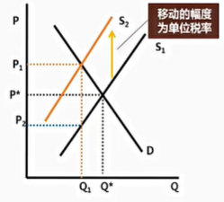

# 5. 征税与补贴

## 5.1. 征税

> 科尔伯特：征税的艺术与拔鹅毛的艺术一样，拔尽可能多的鹅毛，而让鹅的叫声尽可能小
>
> 约翰洛克：尽管你费劲心机去征想征的税，但商人们最终还是把他们自己承担的税收转嫁出去

**向卖者或买者征税如何影响市场结果**

1. 确定向卖者（或买者）征税影响需求还是供给曲线
2. 确定该曲线移动的方向和幅度
3. 考察这种移动如何影响市场均衡价格和数量

**向卖者征税如何影响市场结果**

买方支付的价格（$\text{P}_1$）高于无税收时均衡价格（$\text{P}^*$）；卖方获得的价格（$\text{P}_2$）低于无税收时均衡价格（$\text{P}^*$）

$\text{P}_1$与$\text{P}^*$之差为买方多支付的价格，即买方承担税负；$\text{P}^*$与$\text{P}_2$之差为卖方少收到的价格，即卖方承担税负

1. 税收抑制了市场活动。当对一种物品征收销售税时，该物品在新均衡的数量减少
2. 买者和卖者分摊了税收负担。在新均衡时，买者为该物品支付的更多，卖者则得到的更少

**向买者征税如何影响市场结果**

1. 税收抑制了市场活动。当对一种物品征收消费税时，该物品在新均衡的数量减少
2. 买者和卖者分摊了税收负担。在新均衡时，买者为该物品支付的更多，卖者则得到更少

**税收楔子**

1. 无论是向卖者还是向买者征税，均由买卖双方分摊税负，而且买卖双方承担的税负，在两种情形下相同
2. 税收是买者支付价格和卖者得到价格之间打入的一个楔子。无论是向卖者征收还是向买者征收，楔子相同
3. 两种之间的唯一差别是谁向政府缴税

**政府能否规定以下内容：医疗保险、养老保险、个人和单位实际缴纳的比例、住房公积金等**

解答：政府可以决定税收来自于买者口袋还是卖者口袋，但其不能规定税收的真正负担。税收实际归宿取决于供给和需求的力量（弹性）

**税负归属分析**

税后，生产者出售的商品价格为$\text{P}_1$，消费者支付的价格为$\text{P}_2$，$(\text{P}_2-\text{P}_1)$为政府对单位商品征收的税额，$\frac{\text{P}_2-\text{P}_1}{\text{P}^*}$为政府对该商品征收的税率

尽管该税名义负担者是消费者，实际上却是由买卖双方共同承担。其中生产者承担$(\text{P}^*-\text{P}_1)$部分，而消费者则承担$(\text{P}_2-\text{P}^*)$部分。那么双方承担税收负担的大小，即 $(\text{P}^*-\text{P}_1)$和$(\text{P}_2-\text{P}^*)$的大小是什么决定的呢。

> 1. 需求弹性小意味着买主对消费某种物品没有适当的替代品
> 2. 供给弹性小意味着卖者对生产这种物品没有适当的替代品

**弹性与税收无谓损失**

无论卖者还是买者，弹性越大，征税后逃离市场的愿望和能力越强，丧失的交易机会也就越多。需求弹性和（或）供给弹性越小，在单位商品的征税额固定的情况下，社会福利的损失越小。

在对缺乏弹性的商品征税时，能够逃离市场的消费者和生产者的数量较少。在既定税率下，税收收入（税率乘交易量）会比较高（盐铁专卖）

1. 税收负担更多落在缺乏弹性的一方
3. 弹性衡量的是当市场条件变得不利时，卖者或买者离开市场的能力
4. 当对这种物品征税时，市场中其他选择少的乙方不能轻易离开市场，从而必须承担更多的税收负担

## 5.2. 补贴

**如何分析补贴对市场结果的影响**

1. 确定向卖者（或买者）补贴影响需求还是供给曲线
2. 确定该曲线移动方向和幅度
3. 考察这种移动如何影响市场均衡价格和数量

**补贴楔子**

1. 无论向卖者还是买者补贴，均由买卖双方共同分享了补贴，且分享的补贴在两种情形下相同
2. 补贴是买者支付价格和卖者得到价格之间打入的一个楔子。无论是向卖者还是向买者补贴，楔子相同。两者之间的唯一差别是谁从政府手中拿到名义上的补贴额

**补贴归属分析**

1. 供求双方均取得补贴
2. 补贴较多的落在缺乏弹性的一方
3. 以供给曲线缺乏弹性为例。供给缺乏弹性，补助后，能够增加的供给有限，而需求可以增加很多，过多的需求追逐过少的供给，使得补助的中大部分被供给方取得

## 5.3. 弹性与套利

每个自利的行为人都在不断的寻找并抓住套利的机会，这意味着激烈的套利竞争会使得套利的收益无限接近于0。这些“利”最终到哪去了？

1. 所有的“利”都会流向固定要素的持有者
2. 这和税收的负担的主要承担者还是补贴的主要接收者均是缺乏弹性的一方的结论相一致

从套利的角度看，当利出现时，富有弹性的一方会有大量的新增行为人进入市场进行套利，而缺乏弹性的一方则只有少量，甚至没有新增行为人能够进行市场进行套利。

竞争的结果就是利被缺乏弹性的一方拿走

1. 弹性为套利能力
2. 弹性越强，套利能力越强；弹性越小，套利能力越弱
3. 悖论：套利能力越强的一方，对利的争抢也会越激烈，竞争的结果反而时套利能力弱的一方获利

**如何在套利的世界中让自己过得更好**

缺乏弹性，即竞争较少的一方往往可以获得更多的利。因此，增加自己相对于别人的而市场又需要的独特性时获得更多利的基础。
