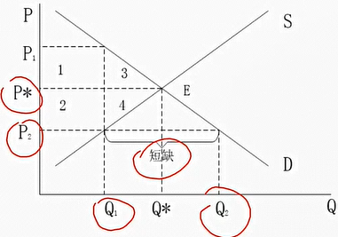
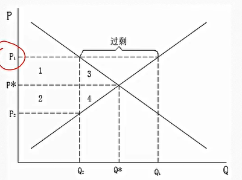

# 6. 政府管制与市场还击

## 6.1. 最高限价

张五常：见到市价变动而管制市价是纯政策，或是利益集团浑水摸鱼的行为。

弗里德曼：价格理论最精美和最有趣的应用大都设计分析各种政府干预的效应。

**政府管制**

1. 价格管制：最高限价、最低限价
2. 数量管制

最高限价

最高限价，又称价格上限，是指可以出售一种物品的法定最高价格。1970年代石油危机期间，美国政府实施汽油最高限价；在美国一些城市有最高房租的限制；中国的医疗服务规定了最高限价

1. 在没有外生力量干预下，市场价格会向着一个使供给数量等于需求数量的水平运动。
2. 要使得市场价格长时间偏离均衡价格，必须有外生力量干预
3. 最常见外生力量是政府干预

生产者愿意提供的商品数量为$\text{Q}_1$，但消费者愿意购买的商品数量为$\text{Q}_2$，$\text{Q}_2$大于$\text{Q}_1$，即在市场上出现供不应求的局面（短缺）

损失福利：1+2+3+4

损失原因：交易机会的丧失（和征税一样）

帕累托非效率-》（最高限价限制了）帕累托改进

**最高限价的帕累托的非效率**

1. 消费者之间配置的非效率。无效率配置：商品没有被分配到评价最高的消费者那里。人们通常只能凭借运气或个人关系才能买到该商品。例如，春运期间的火车票定价偏低，导致回家欲望强的人，买不到车票；房屋租金管制。解决方法，按照福利经济学第二定理，放开市场（私下转售），所以会设置为非法，提高交易成本。
2. 资源浪费的非效率。为取得该商品，搜索时间演唱，且可能不得不排队、托关系等。投入这些行为的资源是非生产性的，这些资源本来可以用于生产和休闲。例如，春运车票偏低，需要不断刷票、托关系买车票；房屋租金管制，搜索时间增加。在考虑这些投入的情况下，消费者为取得该单位该商品，需要付出的代价是$\text{P}_1$而不是$\text{P}_2$。其中$\text{P}_2$为货币代价，$\text{P}_1-\text{P}_2$为非货币代价
3. 低质量的非效率。最高限价不光造成该商品短缺，也使得出售者的价格限制，导致其利润下降。对于出售方而言，不是吸引消费之来购买该商品，而是设法不让消费者购买该商品。比如降低商品的品质和服务，短期会降低商品品质，长期不愿供应的新的商品。
4. 黑市（以房租管制为例）。房租管制增长了租户的非法转租，房东的非法加价，遵守法律的人吃亏。政府管理黑市，纳税人的负担增加，官员不是天使。在市场经济的条件下，歧视需要付出代价，管制使得歧视的成本为0，歧视由供给者实施。

**最高限价没有实现管制者的目标**

房子的真实价格是上升还是下降？因为高档商业和住宅不在租金管制的范围，建造住房的资源被转移到了高档住宅。得益的是富人而不是政策制定者所希望的穷人。

## 6.2. 最低限价

> 1. 最低工资
> 2. 农产品的最低收购价
> 3. 厂商非法勾结，实施最低价格

社会福利的损失：1234

**最低限价的帕累托非效率**

1. 生产者之间配置的非效率。家庭困难的农民工因其均衡工资水准高于最低工资而无法被雇佣或被解雇，导致一个被高工资（实际上是最低工资）吸引，从大学辍学的人找到工作
2. 资源浪费的非效率。在对低工资制度下，希望找到工作的人花费许多时间和经历去寻找工作，或者排队等待工作机会。这些时间和精力本来可以用于生产或休闲
3. 高质量的非效率。最低限价导致质量替代数量。高质量是好事，但必须以消费者愿意购买高质量和低质量的差异为前提。管制使得买卖上方丧失一个市场交易的机会：买方以低得多的价格买到质量相对低的商品
4. 黑市。黑工，为逃避检查，企业不得不付出额外的交易成本。
5. 歧视。最低工资消除了对雇主实施歧视的经济惩罚，他们可以随意选择那些金发白人

**谁是最低工资的积极推动者**

支持最低工资制度（最初）的议员几乎都有工会背景或受到工会资金的支持。工会的目的是通过限制劳动力市场的竞争来维持其高收入和福利

## 6.3. 数量管制

**数量管制相当于最高限价**

**案例：只允许一个家庭购买一辆车**

1. 某地因为雾霾，出台政策，规定一个家庭只能购买一辆轿车
2. 短期，即消费者偏好和生产者产量固定
3. 轿车分为高档车和低档车
4. 市场原先处于均衡状态

**该管制有利于轿车的需求者还是供给者**

1. 需求者。该管制减少了对轿车的需求，导致轿车作为一个整体价格下跌
2. 高档轿车的供给者。假设某家庭原先准备购买两辆低档轿车。现因为数量管制，只能购买一辆，该家庭可能会购买一辆高档轿车，而不是一辆低档轿车。对高档车需求增加，高档车价格上升；对低档车的需求减少，低档车价格下降
3. 管制前的低档车的需求者的福利增加。低档车原先的需求者可以以较低的价格购买轿车。他们不会转化为高档车的需求者。
4. 原先准备买，限制仍购买高档车的需求者福利下降。高档车价格上升，使得原先准备买，现在仍买高档轿车的人支付增加。
5. 原先准备买2辆低档车，现在只能买一辆高档车的福利下降。在原先高档轿车价格便宜，抵挡轿车价格较贵时，需求者选择了两辆低档轿车，而不是一辆高档车。现在高档车的价格上升了，需求者只能购买一辆高档轿车，其福利下降
6. 原先准备买一辆高档车，现在准备买一辆低档车的需求者福利变化不确定。高档车价格上升，低档车的价格下降。其无法选择高档车时其福利损失，但低档车价格下降使其福利增加，具体要确定两者中哪个影响较大

**总结**

1. 该管制有利于轿车的需求者，不利于供给者
2. 该管制有利于高档车的供给者，不利于低档车的供给者
3. 该管制有利于原先准备购买或购买不起低档车的穷人，不利于原先准备购买高档车或原先准备买两辆以上低档车的富人
4. 该管制相当于对富有消费者征税，补贴穷的消费者
5. 该管制能缩小穷富买方之间的贫富差距
6. 该管制扩大了穷（低档车）卖方和富（高档车）卖方之间的贫富差距

## 6.4. 管制与市场均衡

1. 当市场价格低于均衡价格时，会出现供不应求，即出现短缺，在这个时候，需求者之间为得到该商品，会爆发激烈的价格竞争，这个过程直到市场价格等于均衡价格才结束
2. 当市场价格高于均衡价格时，会出现供过于求，即出现过剩，在这个时候，供给者之间为卖出该商品，会爆发激烈的价格竞争，这个过程知道市场价格等于均衡价格才结束

首先，在自由市场中，在价格竞争的作用，价格不会长时间的偏离均衡价格。

政府管制下，最高限价会造成短缺，最低限价会造成过剩。短缺和过剩会不会长期存在？

在价格竞争受到管制后，商品仍然出于供求均衡的状态。只是在新的均衡点，均衡数量由管制价格和供给（或需求）曲线的交点所决定。在该均衡数量上，价格有两个，一个时消费者所支付的价格，是均衡数量和需求曲线的交点，另一个是生产者所取得的价格，是均衡数量和供给曲线的交点。

在最高限价下，为什么消费者为得到该商品所必须支付的价格会高于没有管制时的均衡价格呢？在存在管制时的供给量低于没有管制时的供给量，消费者为得到该商品需要付出的代价当然会更高。为取得该商品，在无法通过价格竞争的情况下，消费者之间会爆发激烈的非价格竞争，如排队、托关系或找黄牛等，非价格竞争同样需要付出代价

消费者为得到商品，需要付出货币代价（管制价格）和非货币代价。在边际意义上，消费者所付出的非货币代价和货币代价之和刚好等于由均衡数量和需求曲线交点所决定的价格

**商品的多维度和管制的失效**

从商品的多维度这个角度看，在管制的环境下，市场依然时均衡的，管制会趋于无效。商品是由多种维度构成。价格维度、数量维度和质量维度。

作为管制方，能够管制住的商品和服务的维度是有限的。人会面对刺激作出反应，当管制方管制商品的一个或多个维度后，供给者或需求方在该商品的其他维度会作出调整，以突破这个管制

1. 最高限价：供给者提供的商品的品质降低
2. 最低限价：供给者提供的商品的品质增加
3. 管制数量：供给者提供的商品的品质降低

在商品的其他维度被突破后，管制趋向于无效。如最高限价下，供给者提供的商品和服务品质会下降，进而使得商品的质量与价格（最高限价下的价格）相匹配，从而促使在最高限价下实现新的供求均衡

## 6.5. 市场决定什么

**管制与租**

1. 政府限制价格变动使得一部分有主之物变成无主之物
2. 经济学将这种无主之物定义为租。因为无主，大家都会去争抢，在争抢过程中各行为主体会付出代价。即部分本来可以用于生产的资源被用于寻租
3. 一个简单的假设是这部分会因为争抢而消耗殆尽，成为社会福利的净损失

资源没有私产权利的保护，竞争使用带来的成本上升侵蚀了资源的租值。

管制是公域对私域的侵犯，这种侵犯使得部分原先归私人所有的部分收入变成了无主之物，而自利的人会想尽各种政府无法想象的方法争抢这种无主之物。

**市价决定什么**

阿尔钦：价格决定什么，比价格怎样决定的重要

市场决定在竞争下谁胜谁负。愿意出价购买的是赢家，不愿意出价购买的是输家。谁有钱谁就能获得商品？不是的，获得商品的是最需要的商品的买家。

其他准则也可以决定谁胜谁负。职称和工龄、分数、排队、行政等级等。

在价格准则被压制的情况下，其他准则就会出现，替代价格准则来决定谁胜谁负。歧视、钥匙费、排队等等，都是替代价格谁胜谁负的准则

张五常：以自己对社会的贡献换取他人对社会的贡献是没有租值耗散的竞争行为，交换的比例是市价。

在价格准则下，为得到自己想要的稀缺物品，就必须支付价格，而其支付的钱全部转化为生产者的收入，从整个社会角度看，资源并没有浪费。自己用于购买稀缺物品的钱来自于出售社会所需要的物品，即从利他而来，是自己对社会的贡献

1. 除了价格外，其他决定胜负的准则都会带来租值的耗散
2. 租值耗散是指由于产权界定不清，公共部分（无主部分）就会成为大家争抢的对象，并带来社会利益的损失
3. 排队时一个典型的约束竞争范例，但排队的时间成本对社会没有任何贡献
