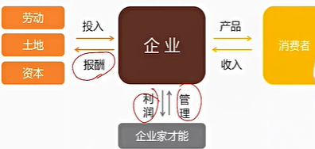

# 7. 企业与企业家

## 7.1. 企业：组织形式与目标

**厂商**

生产者也称厂商或企业，是指能够作出统一生产决策的单个经济单位

从组织形式上看，厂商可以分为

1. 个人企业
2. 合伙制企业
3. 公司制企业

**公司制企业**

按公司法建立和经营的具有法人资格的厂商组织

优势：资金雄厚，有利于实现规模生产，也有利于进一步强化分工和专业化；公司组织形式稳定，有利于生产的长期发展

劣势：规模较大，给内部的管理协调带来困难；公司管理权和所有权分离，将会带来委托代理问题

特点：有限责任和股权可转让

有限责任：公司的合约责任不是所有者的个人责任，被欠债的供给商可以告公司，但不能告任何一个股东，股份可能变得一文不值，但所有者的其他资产却仍可以安然无恙

股权可转让：需要现金的股东或者对公司的经营政策不满的股东可以卖股退出

意义：允许许多庞大的经济活动

1. 对于特定个体，规模太大，无法承受
2. 对于许多个体，无限责任的风险太大

为什么债权人会愿意跟一家只负有限责任的企业做生意？

1. 虽然有风险，但总体上债权人预计能够由此获益
2. 公司要开出足够优惠条件，使得供给商和消费者即使在有限责任的条件下也能做生意

**企业的目标**

在微观经济学中，一般假设企业的经营目标时追求利润最大化（市场份额、收入增长等都不是）。从演化的角度看，在长期，只追求利润最大化的企业才能在竞争中生存下来。实现利润最大化时企业的一个基本准则

张五常：看企业是不是追求利润最大化，不要看它宣称什么，只需要看其是否在边际成本等于边际收益点上生产

## 7.2. 企业的本质

**传统的微观经济学**

把厂商的生产过程看成一个黑匣子，即企业被抽象成一个由投入到产出的追求利润最大化的黑匣子

**经济学强调市场的有效性**

既然市场是万能的，企业为什么会存在。企业作为生产的一种组织形式，是对市场的一种替代

如果没有企业，靠市场如何生产。所有的交易都通过市场在许多的个人之间进行，即生产汽车的各个环节的人通过市场交易，购买上游产品，生产一个环节的产品，卖给下游。

每个人随时可以和其他供应商或集中买主订立关于这项投入品的契约。

一切都建立在市场的基础上，人们可以不断从竞争中获益。

企业家总可以通过竞争性投标对其使用的每一件投入品寻找可以替代的供应商，无论是需要装配的零件、需要使用的会计和计算机设备，还是需要招聘的行政管理人才

作为生产者，在完全依赖于市场时，始终可以最低成本进行招标，还可以利己转换到提出更好交易的其他供应商。

他们不需要承担组建内部生产团队、各部门和各级管理组织的庞大费用。不会承担内部的管理成本，或者和偷懒的员工陷入斗智斗勇。

**企业的本质**

为什么美国只有不到30%的交易通过市场进行，而其余交易通过企业进行。如果市场是非常有效率的，为什么不省去在企业内部的制造，而通过市场完成这一切？

**交易成本**

为确定要进行市场中的交易，个人就必须去发现其欲交易的对象，告知对方交易的医院与条件，进行达成协议的谈判、草拟合约、进行确定对方遵守合约条款所必须的检查等等，这些工作经常要付出极大成本的

交易成本是指在相关各方之间安排契约，或者广义上说安排交易的成本

一类交易成本产生于签约时交易双方面临的偶然性因素所带来的损失。这些偶然性因素或由于实现不可能被预见而未写进契约，或虽然能被预见到，但由于因素太多而无法写进契约

另一类交易成本是签订契约，以及监督和执行契约所花费的成本

## 7.3. 交易成本的细化与计算

**交易成本的三个维度**

1. 专用资产
2. 风险与不确定性
3. 交易频率

**专用资产**

专用性指的是该项资产被重新配置与其他替代用途或是被他人使用时其价值的损失程度

一旦产品的供需双方中的一方对由专用线的资产做了投资，另一方就可以利用其在供给或购买上的垄断地位，以不交易相威胁，以获取另一方的专用性投资所产生的好处

套牢指的是另一方利用垄断地位获取专用性资产和通用性资产的差价

纵向一体化：例如通用公司收购费雪车体

资产专用性越强，为了预防机会主义行为所需要付出的交易成本也可能越高，交易双方越需要建立一种持久的、稳定的契约关系

**企业生产与市场购买**

经理人关键作用之一就是以成本最低的方式获得投入

为了实现更高效率，经理人是从市场获得投入，还是从企业内部获得投入？

现货市场-》长期合同-》垂直一体化生产（全部生产在企业内部进行）

1. 现货市场或现货交易。好处：同专业的供应商打交道，他们通常实现了在企业内部不可能实现的规模经济，交易成本通常较低；问题：卖主可能拼接信息不对称获得不正当利益，投入品质量不稳定，信息会泄露给竞争对手。涉及的通常是通用性产品。
2. 长期合同。好处：专业化分工，能终止与不履行合同的卖主之间的关系，与现货市场相比，减少了卖主对买主的损害；可能的问题：在复杂环境中，这种方法的成本较高，难以准确规定、衡量质量，无法预见的价格变化问题，被不利价格套牢问题
3. 垂直一体化（不向外部的供应者签约购买投入品）。好处：减少了外部企业的投机行为，降低了签订合同发生的成本；生产专业化方面的损失、胜场方法的固定、组织（管理）成本过高。高度专业化的投入品。存在专业化资产或高额的沉没成本，当规模经济发生变化，当协调成为关键：医疗服务的各环节

**汽车工业投入品决策的演变**

**风险与不确定性**

1. 在交易过程中，交易双方都既要面临来自外部环境的不确定性，还要面临来自交易本身的不确定性
2. 需要协调要素的行为以降低不可预测事件对生产的影响
3. 交易风险和不确定性越大，相对于市场交易，组织内部交易成本越低

**交易频率**

如果合作收益来自于许多琐碎小事，则组织内部交易优于市场交易。交易频率对组织制度选择的影响主要体现在设立某种规制结构的费用能否得到补偿，频率越高，组织制度的费用也就越能够得到补偿

## 7.4. 企业规模与边界

**原因一：组织能降低的交易成本有限**

**原因二：代理问题**

**原因三：内部协调资本**

**企业的规模**

**缩小规模**

**扩大规模**

## 7.5. 所有权和控制权的分离

**经理人的管理权不等于所有权**

企业所有权人是剩余索取权人，即企业所有权是有合法权利获得企业扣除所有合约规定要支付的金额之后剩余收入或资产的人

所有者和管理者合二为一有好处，但大型企业通常将两项职能分开。

所有者与其亲自管理企业，不如授权别人去负责和其他资源供给者之间谈判并执行企业合约

原因：企业所有者并不是合适管理这家企业的人，企业所有权分散

**大型公司的治理**

1. 许多股东：不能直接指挥公司运行
2. 执行官：负责企业的管理
3. 董事会：掌握最高权力，并由它雇佣或解雇执行官

事实：

1. 公司的股东并不愿意承担管理公司这种既耗时又费力的责任
2. 监管经理诚实与否的任务留给监管和执法机构
3. 将检测管理效率的任务交给竞争市场

问题：

1. 在大型企业，所有权分散，任何人或家庭只拥有一部分股权，虽然股东是集体选举董事，然后通过董事间接选择经理，但股东个人无权无势
2. 经理人在很大程度上自作主张，可能从事违背股东要求的利益最大化行为

**存在伤害股东的现象**

存在滥用职权和弄虚作假，没有证据表明公司比非公司更严重

**如何解决**

小股东监管经理得不偿失，但大股东有动力监管。外人随时会把一个无能或自私的经理人换下去

**谁换？**

专门从事投资的外部人员经常寻找那些在管理上有提升空间的公司（收购、改善经营、提升股价、出售）。外部投资者比大多数普通股东拥有更多评估公司效率所需要的专业知识和激励

**怎么换？**

如果这家企业的盈利少于应有，股价下跌，外人可以通过以下方式获得控制权

1. 在公开市场上购买股票
2. 向股东提出股权收购以达到控股的目的
3. 在代理人竞争中赢得股东的支持

**委托代理问题**

代理人比委托人有更全面的信息。委托人确认代理人表现的成本很高，这就使得代理人减少了表现的价值。而且，这种情形随着复杂性以及随意性的增加而恶化。

1. 市场本身可以解决部分激励问题
2. 方法：利益兼容，如股权激励，报酬的分期支付等

## 7.6. 谁是企业的所有者

**企业家**

剩余权的索取者。“无论盈余还是亏损，都有我承担”。当所有实现订立的合同都已经兑现完毕，企业家对剩余物有索取权

**监督的需要**

**风险的分担**

**无法定价的商品**

**资产专用性**

## 7.7. 企业家职能

**创新理论**

**产品创新**

**市场创新**

**技术创新**

**资源配置创新**

**组织创新**

## 7.8. 企业家才能与利润

**合同事先确定的收入**

**利润**

**企业家才能的报酬很高？**

## 7.9. 企业家才能与市场过程

## 7.10. 利润与亏损的作用

## 7.11. 企业的兴衰

## 7.12. 关于企业生产的若干提议

## 7.13. 中国企业家：从古到今
