# 8. 市场结构与定价

## 8.1. 完全竞争市场

**市场结构分类**

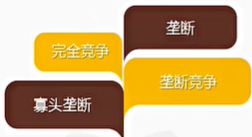

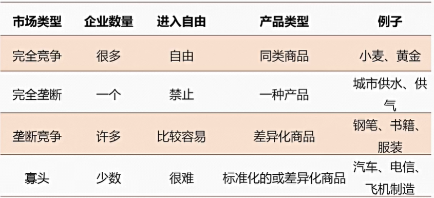

**同质商品**

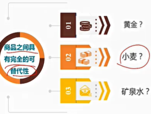

**大量小购买者**

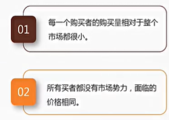

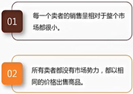

**自由进出**

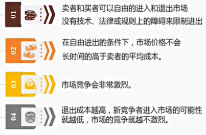

**对称信息**

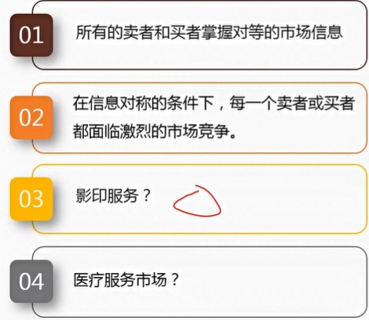

**完全竞争市场的价值**

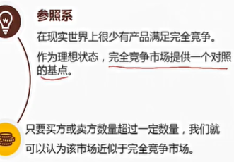

## 8.2. 垄断

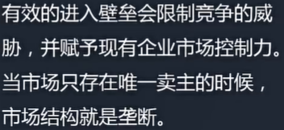

**垄断的成因**

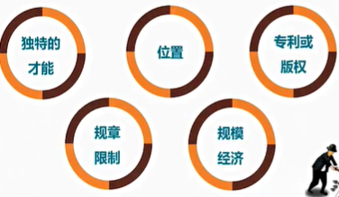

**唯一卖主**

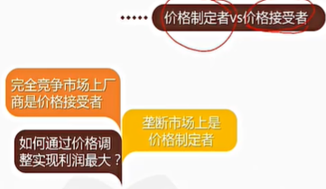

**对卖者而言，价格是其所获得的收入**

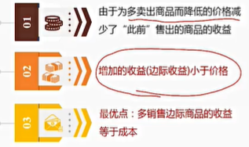

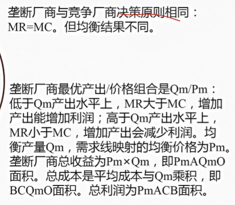

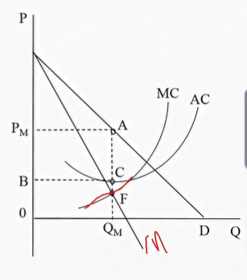

**垄断与福利**

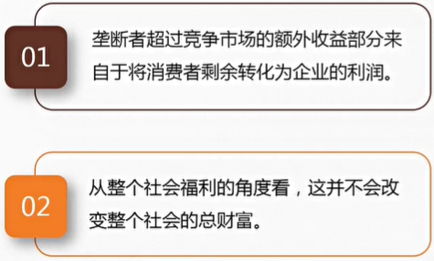

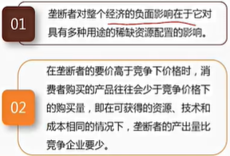

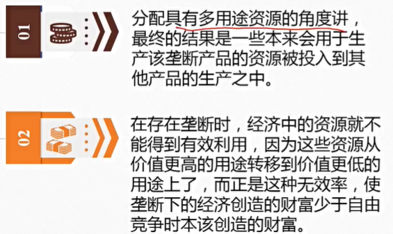

**垄断与企业规模**

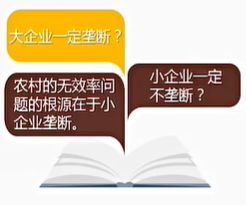

**垄断与动态福利**

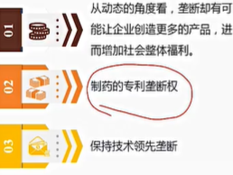

## 8.3. 寡头垄断（寡占）

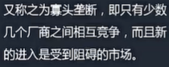

**形成原因**

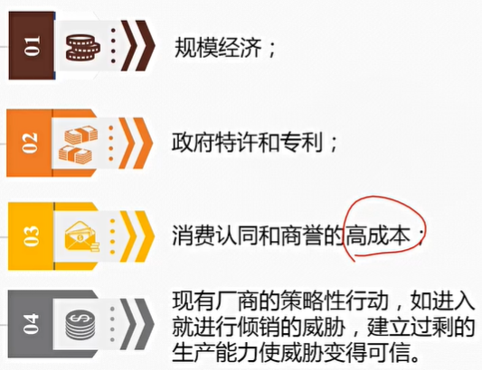

**特点**

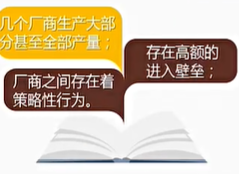

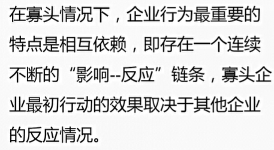

**福利**

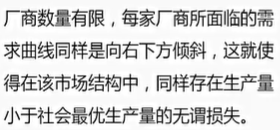

**定价**

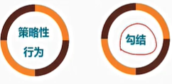

全城最低价：消费者是破坏勾结的最好监督者

**销售价格保证**

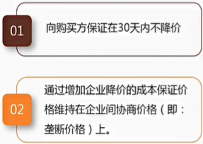

**最惠客户待遇策略**

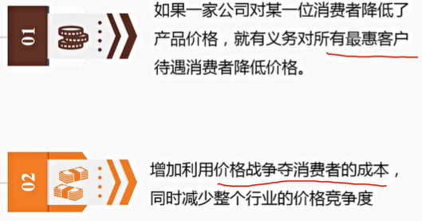

**飞行常客计划**

**公开价格**

**价格领导**

**价格同盟**

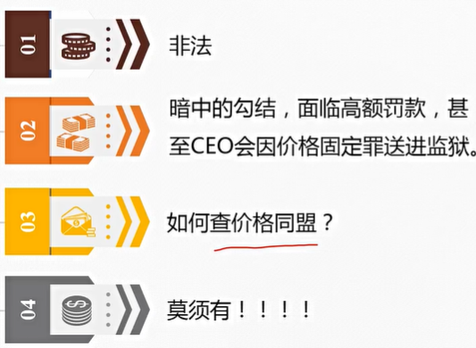

**价格同盟（勾结）天生不稳定**

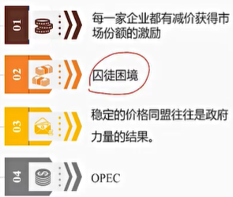

## 8.4. 垄断竞争

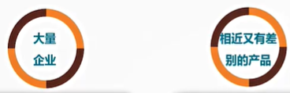

**福利分析**

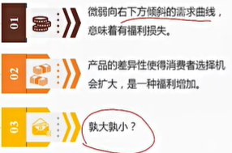

**非价格竞争与广告**

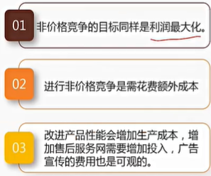

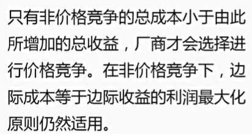

**价格竞争：好或坏？**

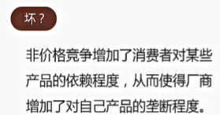

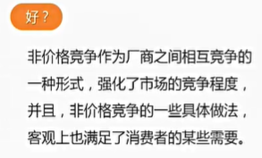

**广告类型**

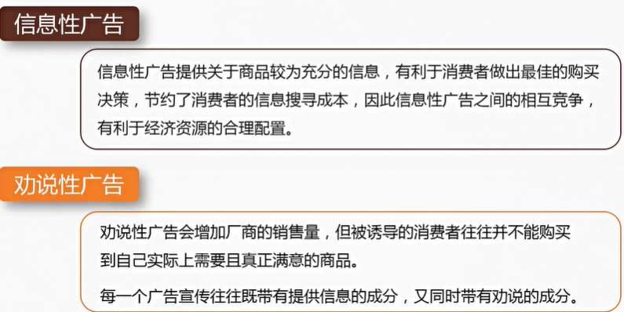

**广告**

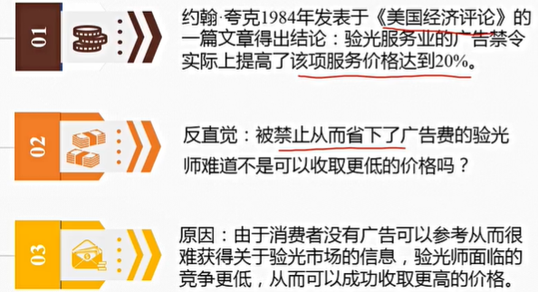

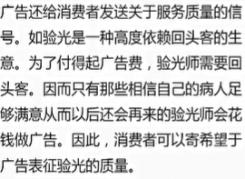

## 8.5. 定价策略总论

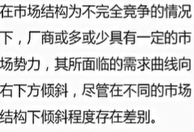

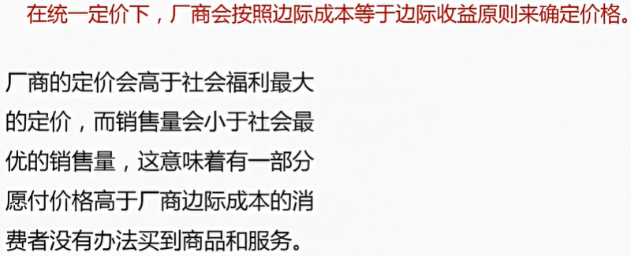

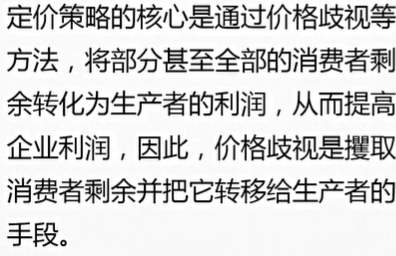

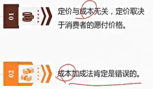

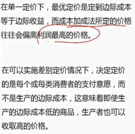

**成本加成法**

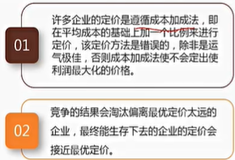

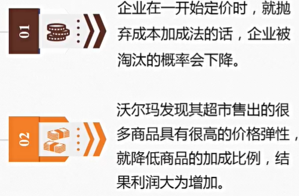

**价格歧视的定义和实施条件**

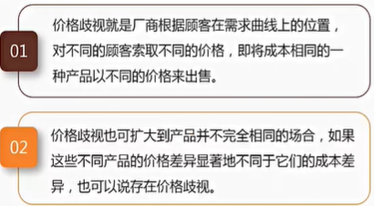

**实施价格歧视具备的条件**

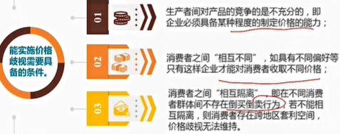

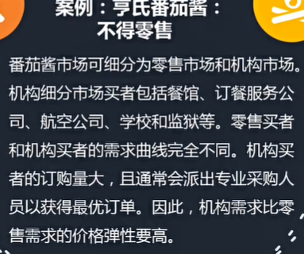

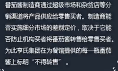

## 8.6. 一级价格歧视

**价格歧视**

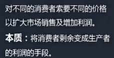

**完全/一级价格歧视**

案例：医生需要知道你的职业吗

**案例：沿着需求曲线移动？**

**案例：大学的学费**

**一级价格歧视**

**案例：all or nothing 需求曲线**

## 8.7. 二级价格歧视

积分卡、月租+话费/套餐

**二步收费制**

**套餐定价法**

## 8.8. 三级价格歧视

案例：微软Office

案例：优惠券

**跨期价格歧视**

精装书和简装书

## 8.9. 非货币代价与三级价格歧视

**生产者知道每个或每类消费者的弹性吗**

## 8.10. 如何区隔市场

**如何区隔市场**

## 8.11. 捆绑销售

**捆绑销售增加利润的原因**

**混合捆绑销售**

