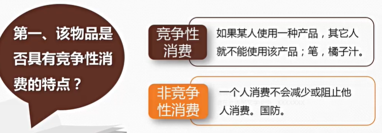
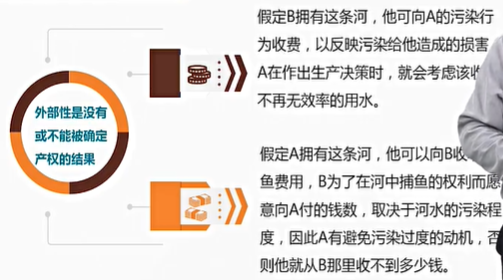
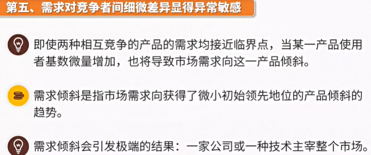

# 9. 公共物品与外部性

## 9.1. 公共物品的定义

**关于公共物品的两个基本问题**

**纯公共物品的定义**

**非纯公共物品**

**公共池塘产品**

**俱乐部产品**

**公共物品和市场失灵**

## 9.2. 公共物品的最优水平

**产出的有效水平**

## 9.3. 公共物品的私人提供

**市场如何解决公共物品提供的问题**

**总结**

## 9.4. 外部性的定义

**金钱外部性**

**外部性**

**外部性的根源**

**外部性的特征**

## 9.5. 外部性与资源配置的低效率

**正外部性与资源配置的低效率**

**小结**

**负外部性与资源配置的低效率**

**小结**

## 9.6. 解决外部性的私人方法

**社会习俗和道德约束**

**明确产权和谈判：科斯定理**

**合并**

## 9.7. 解决外部性的公共政策

**征税**

**补贴**

**创造市场**

**规制**

## 9.8. 网络效应和网络外部性

**不是新的问题**

**网络效应**

**网络外部性**

**具有网络效应或网络外部性市场的特点**

